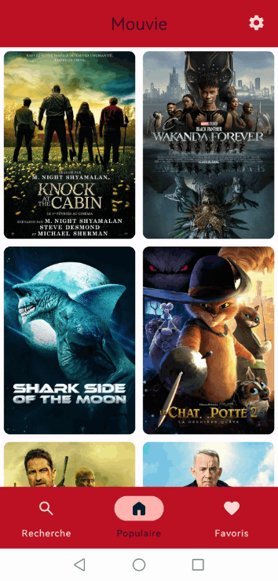

# Project 2 Kotlin of CVBB : Mouvie !

## Table des matières

1. [Getting Started](#getting-started)
2. [Contexte](#contexte)
3. [Introduction](#introduction)
4. [Contributors](#contributors)
5. [Best Practices](#best-practices)
6. [Technologies](#technologies)  
7. [Architecture](#architecture)  
8. [Dependencies](#dependencies)  
9. [Showtime](#showtime)  
10. [Coming](#coming) 
10. [Why the project deserves points ?](#why-the-project-deserves-points-?) 
11. [Contact](#contact)  

## Getting Started

This is an _Android_ project made with _Kotlin_ language.

### Prerequisites

Install [Android Studio](https://developer.android.com/studio), see instructions.

### Installation

1. Clone the repo
   ```sh
   git clone https://gitlab.com/Clara1606/mouvie-kotlin.git
   ```
2. Choose, _Open an Existing Project_ in _Android Studio_ 

## Context
For the first level 2 mobile development project of this year, we are coding a native android app with Kotlin.

## Introduction
We wanted to start a project from scratch in order to be able to put in place all the good practices, and push our architecture further.  
We wanted to use an API to see how it works in Kotlin, and since we love movies, we decided to create Mouvie !  
an application that lists the list of films that exist.
Thanks to us, you will be able to search for a film, see the most popular of the moment and add them to your favorites!


## Contributors
- Bastien BRUNET M1 Développement Logiciel, Mobile et IOT
- Clara VESVAL M1 Développement Logiciel, Mobile et IOT

We know each other since the start of third year and are used to work together.
We are complementary.

## Best Practices

It's all on the branch main.

We have to foolow the good practices of an android and kotlin project.
- [X] Customize color in App bar
- [X] Change the launcher icon
- [X] Add a language
- [X] Use of string.xml (/!\ hard coded var /!)
- [X] Coherence in naming convention (See naming convention of [Kotlin for Android project](https://gitlab.com/chillcoding-at-the-beach/kotlin-for-android/-/wikis/Naming-Convention).)
- [X] Code in english
- [X] Use of versions variables in Gradle files
- [X] Read me
- [X] GIT Flow
- [X] Commits on GIT 
- [X] Menu
- [X] Use of layouts 
- [X] Use of cards, alert dialog and other Material Design items 
- [X] Use of the ViewBinding  
 - [X] App class
 - [X] Compose 
 - [X] RecyclerView
 - [X] Room


## Technologies
We are using Android Studio Electrical Eel (Be careful if you're not using this version, there could be some compatibility issues)
We are compiling in Android 33, our target is Android 33
Gradle Version : 7.5

## Dependencies

### Libraries
  * [Glide to redimissesier an image](https://github.com/bumptech/glide)
  * Compose (androidx.compose:compose-bom:2022.12.00)
  * Room (androidx.room:room-ktx)
  * LiveData (androidx.lifecycle:lifecycle-livedata-ktx)
  * Coroutine (org.jetbrains.kotlinx:kotlinx-coroutines-android)
  * Material 3 (androidx.compose.material3:material3:1.0.0-alpha11)
  * DataStore (androidx.datastore:datastore)
  * Retrofit (com.squareup.retrofit2:retrofit)
  * OkHttp 3 (com.squareup.okhttp3:okhttp)

### Other
  * [View Binding, Part of Android Jetpack](https://developer.android.com/topic/libraries/view-binding)

## Architecture
Our application is available in English and French

## API 
We use the API: https://www.themoviedb.org/

We had to create an account, and we can use it for free if it's not for commercial purposes.

### Routes used
- GET /movie/popular -> Used in the trending screen
- GET /movie/{id} -> Get the movie details
- GET /movie/{movieId}/recommendations -> Get the recommendations based on the given movie
- GET /movie/{movieId}/similar -> Get the similar movies based on the given movie
- GET /movie/{movieId}/credits -> Get the cast and crew of the given movie
- GET /search/movie -> Search movies based on the given input
- GET /movie/{movieId}/watch/providers -> Get the watch providers of the given movie

## Database
For favorites, we use the ORM Room.
If we press on the film in favorites, we see its detail, if we keep pressing (LongPress) we can delete it from our favorites if you want  
   
This makes it possible to have an SQLite database integrated into our application.

Our database is very simple:


We just had to be able to have:
- We put an id at first, if we ever wanted to push our database a little further by making relationships with the films and the user (even if we know that it is possible to make a composite key with the 'user_id and movie_id)
- the id of the film (in order to be able to see its detail by calling the API)
- Its name directly to avoid redoing an API request
- And finally its image for the same reasons of the name.

We could have made it more complex, for example by making a Movie table linked to Favorites.
But we didn't see any use for our use which remains very simple but it is in our possible improvements.
We have also decided not to put all the information in the database so as not to overload it, whereas we can simply reuse the "Details of a film" page which does the search directly by calling the API

## Datastore

We implemented a datastore system on top of the room implementation used to store the favorites. 
The original idea behind the datastore was to store the languages settings and be able to adjust them while the app is running. 
Eventually we realized that the android system is not designed to do just that, the language settings are supposed to come from the phone settings.
Facing this issue we decided to remove this feature from the app while keeping the datastore implementation for later use.

## Infinite scroll

On the trending page we decided to go for a basic infinite scroll system based on the LazyGrid widget.
The goal here was to be able to go through the big amount of data available in the API which is organized in pages.
 
The scroll system is pretty basic, the logic resides in an extension function of the LazyGridWidget that triggers a function each time the bottom is reached, that way we can load more data and append it to the previously loaded data. 

Later during the app development we integrated infinite scrolls extension functions to more widget such as the LazyRow which is used in the Similar movies section of the movie detail

## Search

We've added a search page to be able to search for movies we already know and get detail about them
This allowed used to implement a more advanced usage of the TextInput widget because we wanted to have a realtime update of the result as we type.

## Movie detail

The movie detail page is the biggest part of the app, it is the most re-used composable of the app and the more complex one.

Here is a list of the different parts of this page :
- An image of the movie
- The favorite button in order to add / remove the movie of the user favorites (Room db)
- The genre list (additional API request)
- Where to buy / rent / stream the movie (additional API request)
- The cast (additional API request)
- The recommended movies based on the one in the details (additional API request)
- The similar movies (additional API request)


## Showtime
Here is a simple demonstration of how the app is designed to be used, starting from the home screen to the end result : 

### V1 



You will find in the readme_images folder, a video demonstration of our application, as well as our oral presentation in pdf

## Coming 
### Technical
- We would like to be able to use a database on a server, and add a connection system to the application so that anyone can find their account on any device.
- We would also like to be able to put the application on the stores (but for that we would need to have an authorization to use the API commercially)
- Make our Android application, a cross-platform application

### New features
- Add in settings if you want adult movies
- Add  in your application
- To have the follow-up of this one (how many episodes or seasons are left, etc)
- Add filters for searches (Genre / Movies / Series ...)
- Can rate movies

## Why the project deserves points ? 
Our project is well structured, it respects good practices.  
Everything is well defined in a package in a clear way to find your way around. There are comments to say what have done if someone has to take over the project.  
We use the latest technologies with Compose, Material 3 (which we have customized), and we use the ORM Room with a strong architecture with Model/DAO/Repository/View Model
The app is easy to use  

## Contact 

Clara Vesval, on (https://clara-1606.github.io/) [![LinkedIn][linkedin-shield]][linkedin-url-clara].  
Bastien Brunet [![LinkedIn][linkedin-shield]][linkedin-url-bastien].

[linkedin-shield]: https://img.shields.io/badge/-LinkedIn-black.svg?style=for-the-badge&logo=linkedin&colorB=555
[linkedin-url-clara]: https://www.linkedin.com/in/clara-vesval-84b911193/
[linkedin-url-bastien]: https://www.linkedin.com/in/bastienbrunet/
