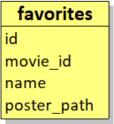

# Project 2 Kotlin of CVBB : Mouvie !

## Table des matières

1. [Getting Started](#getting-started)
2. [Contexte](#contexte)
3. [Introduction](#introduction)
4. [Contributors](#contributors)
5. [Best Practices](#best-practices)
6. [Technologies](#technologies)  
7. [Architecture](#architecture)  
8. [Dependencies](#dependencies)  
9. [Showtime](#showtime)  
10. [Coming](#coming) 
11. [Contact](#contact)  

## Getting Started

This is an _Android_ project made with _Kotlin_ language.

### Prerequisites

Install [Android Studio](https://developer.android.com/studio), see instructions.

### Installation

1. Clone the repo
   ```sh
   git clone https://gitlab.com/Clara1606/mouvie-kotlin.git
   ```
2. Choose, _Open an Existing Project_ in _Android Studio_ 

## Context
For the first level 2 mobile development project of this year, we are coding a native android app with Kotlin.

## Introduction
We wanted to start a project from scratch in order to be able to put in place all the good practices, and push our architecture further.  
We wanted to use an API to see how it works in Kotlin, and since we love movies, we decided to create Mouvie !  
an application that lists the list of films that exist.
Thanks to us, you will be able to search for a film, see the most popular of the moment and add them to your favorites!


## Contributors
- Bastien BRUNET M1 Développement Logiciel, Mobile et IOT
- Clara VESVAL M1 Développement Logiciel, Mobile et IOT

We know each other since the start of third year and are used to work together.
We are complementary.

## Best Practices

It's all on the branch main.

We have to foolow the good practices of an android and kotlin project.
- [X] Customize color in App bar
- [X] Change the launcher icon
- [X] Add a language
- [X] Use of string.xml (/!\ hard coded var /!)
- [X] Coherence in naming convention (See naming convention of [Kotlin for Android project](https://gitlab.com/chillcoding-at-the-beach/kotlin-for-android/-/wikis/Naming-Convention).)
- [X] Code in english
- [X] Use of versions variables in Gradle files
- [X] Read me
- [X] GIT Flow
- [X] Commits on GIT 
- [X] Menu
- [X] Use of layouts 
- [X] Use of cards, alert dialog and other Material Design items 
- [X] Use of the ViewBinding  
 - [X] App class
 - [X] Compose 
 - [X] RecyclerView
 - [X] Room


## Technologies
We are using Android Studio Electrical Eel (Be careful if you're not using this version, there could be some compatibility issues)
We are compiling in Android 33, our target is Android 33
Gradle Version : 7.5

## Dependencies

### Libraries
  * [Glide to redimissesier an image](https://github.com/bumptech/glide)
  * Compose (androidx.compose:compose-bom:2022.12.00)
  * Room (androidx.room:room-ktx)
  * LiveData (androidx.lifecycle:lifecycle-livedata-ktx)
  * Coroutine (org.jetbrains.kotlinx:kotlinx-coroutines-android)
  * Material 3 (androidx.compose.material3:material3:1.0.0-alpha11)

### Other
  * [View Binding, Part of Android Jetpack](https://developer.android.com/topic/libraries/view-binding)

## Architecture
Our application is available in English and French

## API 
We use the API: https://www.themoviedb.org/

We had to create an account, and we can use it for free if it's not for commercial purposes.

## Database
For favorites, we use the ORM Room.
This makes it possible to have an SQLite database integrated into our application.
Our database is very simple:



We just had to be able to have:
- We put an id at first, if we ever wanted to push our database a little further by making relationships with the films and the user (even if we know that it is possible to make a composite key with the 'user_id and movie_id)
- the id of the film (in order to be able to see its detail by calling the API)
- Its name directly to avoid redoing an API request
- And finally its image for the same reasons of the name.

We could have made it more complex, for example by making a Movie table linked to Favorites.
But we didn't see any use for our use which remains very simple but it is in our possible improvements.
We have also decided not to put all the information in the database so as not to overload it, whereas we can simply reuse the "Details of a film" page which does the search directly by calling the API


## Showtime
Here is a simple demonstration of how the app is designed to be used, starting from the home screen to the end result :

### V1 


## Coming 
- We would like to be able to use a database on a server, and add a connection system to the application so that anyone can find their account on any device.
- We would also like to be able to put the application on the stores (but for that we would need to have an authorization to use the API commercially)
- Finally, we would like to be able to make our Android application, a cross-platform application
- Add  in your application
- To have the follow-up of this one (how many episodes or seasons are left)
- Add filters for searches (Genre / Movies / Series ...)


## Contact 

Clara Vesval, on (https://clara-1606.github.io/) [![LinkedIn][linkedin-shield]][linkedin-url-clara].  
Bastien Brunet [![LinkedIn][linkedin-shield]][linkedin-url-bastien].

[linkedin-shield]: https://img.shields.io/badge/-LinkedIn-black.svg?style=for-the-badge&logo=linkedin&colorB=555
[linkedin-url-clara]: https://www.linkedin.com/in/clara-vesval-84b911193/
[linkedin-url-bastien]: https://www.linkedin.com/in/bastienbrunet/
